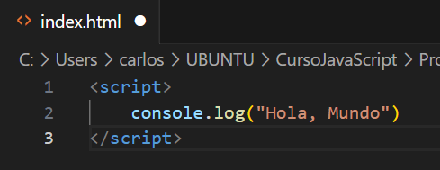

# JavaScript 1

Date Created: 27 de julio de 2023 15:33
Status: Doing

# Ejecutar JavaScript

Se ejecuta por medio de VSC. Se debe crear un archivo index.html y en las líneas de código, poner <script>. Esto le da a entender al editor que estamos trabajando en Java

Consola: Es donde se ve el resultado del código JS

Para verlo, abrimo el archivo index.html y se abrirá en Chrome. Ahora se usa Ctrl+shift+j para ver la consola

# Comentarios

Son textos que se incluyen pero que no hacen parte del código como tal. Son usados como guía

Se hacen con dos

//

# Variables

Tipos de datos: Undefined (no existe valor asignado), null (nulo), boolean (booleano), string (cadena de caracteres), symbol, number (numero) & object

Variable: Crea un espacio en el dispositivo y guarda un valor en ese lugar de memoria

# Operador de Asignación

Si se definen variables pero no su valor, en la consola se verá reflejado como valor indefinido

Podemos darle un valor a la variable despues de creada

# Asignar el valor de una variable a otra variable

# Variables no Inicializadas

Son aquellas variables a las que no se les ha asignado un valor

# Mayúsculas y Minúculas

En JS es importante que las variables sean escritas como se declararon, respetando mayúsculas y minúsculas

# Operaciones Aritméticas

# Números Decimales

Aplican la misma manera de las operaciones artiméticas

# Residuo de una división.

Esta operación da el valor del residuo de una división, es decir si divido 17/3 nos da 5,6. Pero el residuo es aquello que no se puede dividir de manera entera es decir que daría 5 y residuo 2. Se hace con%

# Incrementar el valor de una variable

# Reducción del valor de una variable

# Asignación de Suma

Cuando se desea sumar una variable a un numero, se puede hacer de forma abreviada

Otro Ejemplo

# Asignación de Resta

# Asignación de la Multiplicación

# Asignación de División

# Variable con Cadenas de Caracteres

# Escapar Comillas en Cadenas de Caracteres

Si se desea declarar una variable de caracteres que incluyan comillas, debe hacerse de la siguiente manera \”texto”

# Escape de Caracteres con Comillas Simples

Se puede hacer también intercalando comillas simples y comillas dobles como se muestra en los ejemplo

# Secuencias de Escape

Son combinaciones de caracteres que no se representan a sí mismos como caracteres como tal

# Concatenar Cadenas de Caracteres

# Construir Cadenas con Variables

# Agregar Variables a Cadenas de Caracteres

# Longitud de una cadena de caracteres

Para conocer la cantidad de caracteres de una variable, al momento de imprimir se agrega .lenght, es decir console.log(variable.length)

# Notación de Corchetes: Primer Caracter

Nos permite acceder a un caracter especial de una cadena

# Inmutabilidad de Cadena de Caracteres

Una vez definida una cadena de caracteres, no es posible cambiar algún elemento de ella.

# Notación de Corchetes: Enésimo Caracter

# Notación de Corchetes: Último Caracter

# Notación de Corchetes: De Derecha a Izquierda

y Así sucesivamente

# Palabras en Blanco

Vamos a hacer que un texto se imprima en la consola declarando varibales de las palabras 

# Arreglos (Arrays)

Son estructuras que permiten almacenar múltiples valores  en una misma estructura. Son como vectores.

# Arreglos Anidados

Se pueden crear arreglos en los que los elementos del mismo, sean arreglos. A esto se le llaman arreglos anidados

# Identificación de un elemento de un arreglo

Se puede ubicar un elemento de un arreglo mendiante su posición

# 

# Modificar los datos de un arreglo

Se pueden hacer modificaciones a los datos de un arreglo mediante la declaración de su valor

# Acceder a Arreglos Multidimensionales

Se hace mediante definicions de subindices

# .push()

Este método agrega a un arreglo un valor al final de este

# .pop()

Este método elimina el último  elemento del arreglo, pero adicional nos permite guardarlo en una nueva variable

# .shift()

Elimina el primer elemento de un arreglo

# .unshift()

Agrega un elemento al principio de un arreglo. Dentro del paréntesis se define el valor que debe tomar ese elemento que vamos a agregar

# Lista de Compras

Se pueden imprimier mensajes en la consola usandop las ubicaiones de los arreglos

# Funciones

Se pueden escribir código que se puede reutilizar

