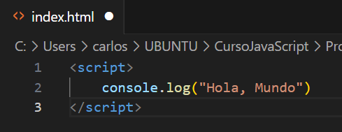

# JavaScript 1

Date Created: 27 de julio de 2023 15:33
Status: Doing

# Ejecutar JavaScript

Se ejecuta por medio de VSC. Se debe crear un archivo index.html y en las líneas de código, poner <script>. Esto le da a entender al editor que estamos trabajando en Java

Consola: Es donde se ve el resultado del código JS

Para verlo, abrimo el archivo index.html y se abrirá en Chrome. Ahora se usa Ctrl+shift+j para ver la consola

# Comentarios

Son textos que se incluyen pero que no hacen parte del código como tal. Son usados como guía

Se hacen con dos

//

# Variables

Tipos de datos: Undefined (no existe valor asignado), null (nulo), boolean (booleano), string (cadena de caracteres), symbol, number (numero) & object

Variable: Crea un espacio en el dispositivo y guarda un valor en ese lugar de memoria

# Operador de Asignación

Si se definen variables pero no su valor, en la consola se verá reflejado como valor indefinido

Podemos darle un valor a la variable despues de creada

# Asignar el valor de una variable a otra variable

# Variables no Inicializadas

Son aquellas variables a las que no se les ha asignado un valor

# Mayúsculas y Minúculas

En JS es importante que las variables sean escritas como se declararon, respetando mayúsculas y minúsculas

# Operaciones Aritméticas

# Números Decimales

Aplican la misma manera de las operaciones artiméticas

# Residuo de una división.

Esta operación da el valor del residuo de una división, es decir si divido 17/3 nos da 5,6. Pero el residuo es aquello que no se puede dividir de manera entera es decir que daría 5 y residuo 2. Se hace con%

# Incrementar el valor de una variable

# Reducción del valor de una variable

# Asignación de Suma

Cuando se desea sumar una variable a un numero, se puede hacer de forma abreviada

Otro Ejemplo

# Asignación de Resta

# Asignación de la Multiplicación

# Asignación de División

# Variable con Cadenas de Caracteres

# Escapar Comillas en Cadenas de Caracteres

Si se desea declarar una variable de caracteres que incluyan comillas, debe hacerse de la siguiente manera \”texto”

# Escape de Caracteres con Comillas Simples

Se puede hacer también intercalando comillas simples y comillas dobles como se muestra en los ejemplo

# Secuencias de Escape

Son combinaciones de caracteres que no se representan a sí mismos como caracteres como tal

# Concatenar Cadenas de Caracteres

# Construir Cadenas con Variables

# Agregar Variables a Cadenas de Caracteres

# Longitud de una cadena de caracteres

Para conocer la cantidad de caracteres de una variable, al momento de imprimir se agrega .lenght, es decir console.log(variable.length)

# Notación de Corchetes: Primer Caracter

Nos permite acceder a un caracter especial de una cadena

# Inmutabilidad de Cadena de Caracteres

Una vez definida una cadena de caracteres, no es posible cambiar algún elemento de ella.

# Notación de Corchetes: Enésimo Caracter

# Notación de Corchetes: Último Caracter

# Notación de Corchetes: De Derecha a Izquierda

y Así sucesivamente

# Palabras en Blanco

Vamos a hacer que un texto se imprima en la consola declarando varibales de las palabras 

# Arreglos (Arrays)

Son estructuras que permiten almacenar múltiples valores  en una misma estructura. Son como vectores.

# Arreglos Anidados

Se pueden crear arreglos en los que los elementos del mismo, sean arreglos. A esto se le llaman arreglos anidados

# Identificación de un elemento de un arreglo

Se puede ubicar un elemento de un arreglo mendiante su posición

# 

# Modificar los datos de un arreglo

Se pueden hacer modificaciones a los datos de un arreglo mediante la declaración de su valor

# Acceder a Arreglos Multidimensionales

Se hace mediante definicions de subindices

# .push()

Este método agrega a un arreglo un valor al final de este

# .pop()

Este método elimina el último  elemento del arreglo, pero adicional nos permite guardarlo en una nueva variable

# .shift()

Elimina el primer elemento de un arreglo

# .unshift()

Agrega un elemento al principio de un arreglo. Dentro del paréntesis se define el valor que debe tomar ese elemento que vamos a agregar

# Lista de Compras

Se pueden imprimier mensajes en la consola usandop las ubicaiones de los arreglos

# Funciones

Se pueden escribir código que se puede reutilizar

# Argumentos

Las variables de la función se dfinen como parámetros

para este caso, los parámetros son a y  b

dentro de esa función SUMAR se define que hará esta función

Para este caso, hará la suma de a+b y muestra en la consola la suma de estos

Ahora, con la función definida, podemos llamarla con los valores que queramos darle a a y b

Y así se muestra en la consola

Los argumentos, son los VALORES QUE SE LE ASIGNAN A LOS PARÁMETROS. Es decir, un argumento es un parámetro con valor

Los parámetros también pueden ser definidos mediante variables de la siguiente manera

# Ámbito Globales

Es una variable que se puede usar en cualquier parte del programa, ya que está definida en el programa principal (no dentro de una función)

# Ámbito Local

Son variables definidas dentro de una función, y solo se pueden usar dentro de esa función

# Diferencias entre Global y Local

Si tengo dos variables con el mismo nombre, una local y otra global estas tienen diferentes jerarquías según en donde se usen. Si se usan dentro de una función, va a tener mayor jerarquía la variablo local. Si se hace fuera de la función, tendrá jerarquía la global (ya que las locales no pueden usarse fuera de la función)

[https://www.notion.so](https://www.notion.so)

# Retornar un Valor

Tenemos la funcion sumar, dentro de la funcion no siempre es necesario imprimir en la consola el resultado. Podemos calcularlo y guardar el valor sin necesidad de imprimir. Para es usamos la palabra reservada return. Asi queda el valor guardado y posteriormente podemos usarlo bien sea para imprimirlo, o para otros calculos

# Undefined

Si se define la función sumar y dentro de la función no retornamos la suma, el valor mostrado deberá ser UNDEFINED. Es decir, siempre debemos retornar el valor

# Asignar un valor retornado

Se puede asignar una variable al retorno de una función. Se define la función y su variable, dentro de la función se define que es lo que vamos a retoirnar. En este caso es un mensaje. Despues de esto, fuera de la funcion definimos una valiable que será igual a la funcion creada definida en la una variable especifica, ene ste casi “JavaScript”

# Permanece en Línea (queue)

En informática, una cola o queue, es una estructura de datos abstracta en la cual los elemntos se mantienen en orden. Los nuevos elementos se pueden añadir al final de la cola y los elementos previos se retiran del principio de la cola

# Valores Booleanos

Son valores que pueden tomar valores de verdadero o falso. True or False. Deben escribirse en minuscula siempre (true & false).

# Operador de Igualdad ==

Es un opoerador que compara la igualdad de dos términos. Su resultado será un opoerador booleano-

NO DEBERIAN USARSE PARA COMPARAR ARREGLOS

# Operador de Igualdad Estricta ===

Nos permite comparar si los datos son iguales y son del mismo tipo

# Práctica de como comparar valores

# Operadores de Desigualdad ! =

Es un operador que compara la igualdad de dos valores. Su respuesta será true si son distintos y false si son iguales. Es lo opuesto a los operadores de igualdad

TAMPOCO DEBE USARSE PARA COMPARAR ARREGLOS

# Operador de Desigualdad Estricta ! = =

Funciona igual que el operadod de igual estricta, compara el valor y el tipo de datos. Si son iguales retornará false, si son diferentes retornara true

# Operador Mayor Que

Compara el valor absoluto de un valor con respecto a otro. Si se da la condición será true, si no false.

Para cadenas de caracteres, se dará por orden alfabético donde a es el menor valor y z el mayor

También será usado en variables

# Operador Mayor o Igual que ≥

Adiciona la condición de mayoría e igualdad

# Operador Menor que < y menor o igual que ≤

Funcionan de manera similar que los dos operadores anteriores

# Operador Lógico AND &&

Nos permiten combinar expresiones para elaborar condiciones mas elaboradas

Los operadores lógicos tiene tablas de verdad que determinan sus valores de salida

# Operador Lógico OR ||

# Operador Lógico NOT !

Se usa para negar un valor de salida

# Sentencias Condicionales IF

Nos permiten elegir si un bloque de código se ejecuta o no

# Cláusula ELSE

# Cláusula ELSE IF

Es para anidar IF y ELSE conjuntamente

# Encadenar if….else

Ejercicio Práctico

# Código de Golf

Ejercicio Práctico

